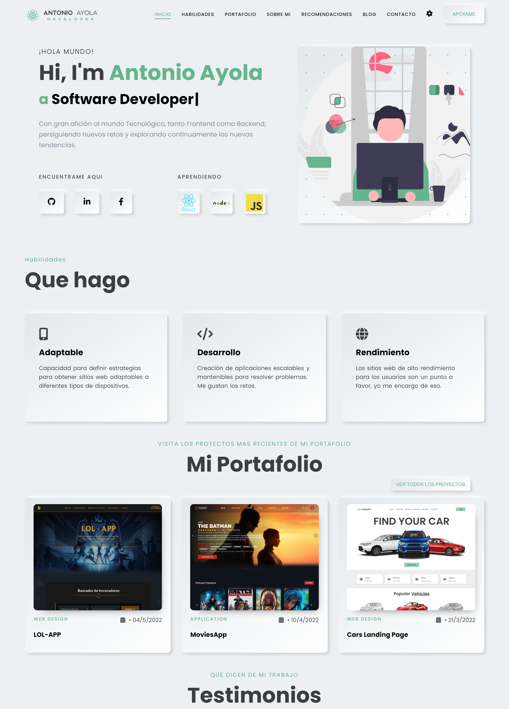
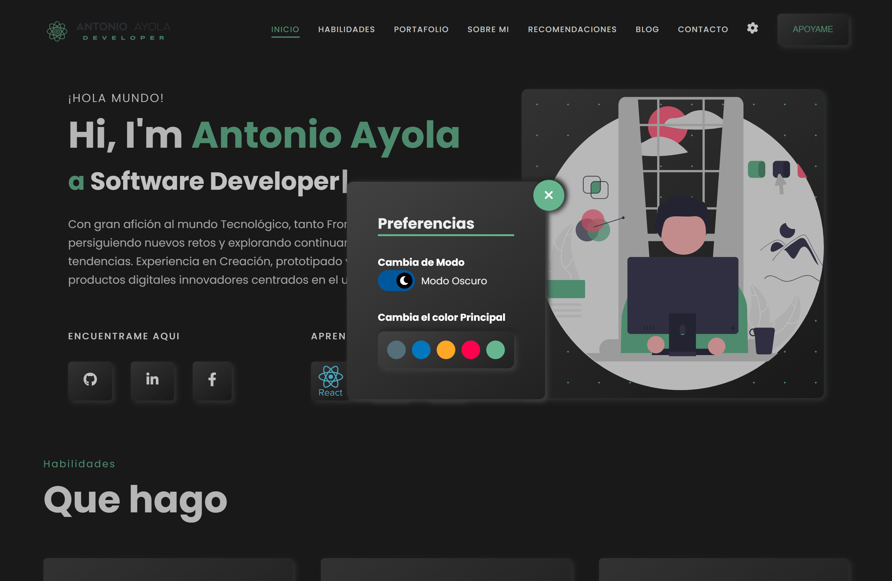

# **Erika Juliana Ruiz PORTAFOLIO**

Este proyecto es mi portafolio profesional donde muestro mis skills, que experiencia tengo y en que me estoy especializando.

Este portafolio es una PWA, asi que puedes instalar la aplicacion en tu dispositivo.

## **CAPTURAS**

## **TECNOLOGIAS**

Para el portafolio utilice las siguientes tecnologias:

- ReactJS
- Modules CSS
- Netlify
- PWA

## **USO**

Para usar este proyecto:

- Clonar repositorio:
- Instalar dependencias: `npm install` o` yarn install`
- Ejecutarlo: `npm start` o ` yarn start`
